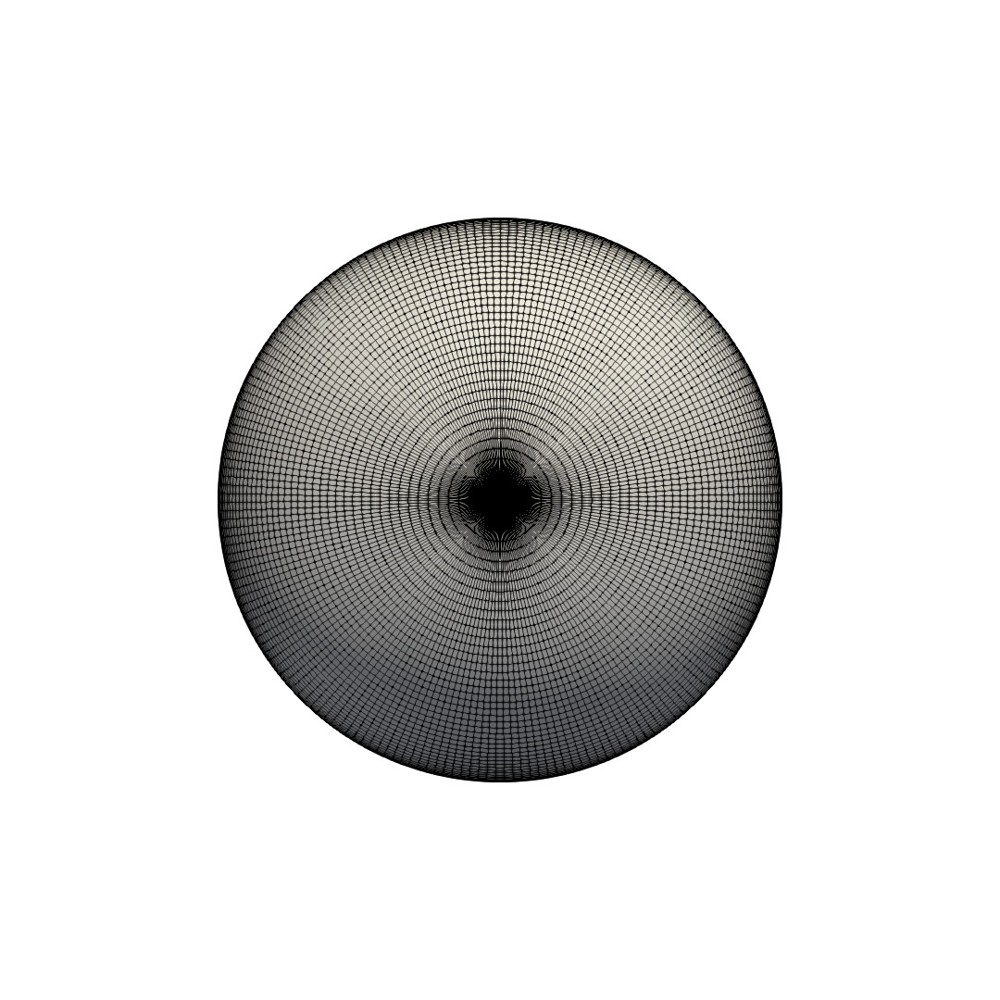

# SphereSurface

**SphereSurface** generates the structured surface mesh of a sphere in formatted PLOT3D format (file extension .xyz).

* The sphere is centered about the origin (0, 0, 0).
* There are multiple parameterizations to choose from.
* Some of the parameterizations have overlapping mesh parts to be used with overset grid schemes. Mesh joining routines are used as a post process to intersect the mesh parts where they overlap along a seam. In this case for a sphere, final mesh will be water-tight (i.e. have no holes). The joining methods are not included here.

**SphereSurface** is designed to be used for high-fidelity computational solvers that need precise control over the surface mesh properties. Some such surface mesh properies include:

* Resolution of geometry (total number of cells).
* Ratio of smallest to largest cells.
* Regularity of cell shape.
* Presence or absense of singularities.

## PLOT3D Format

The PLOT3D formatted file (extension .xyz) is described by its read method written in **Fortran 77** for **Structured, 3D, Whole, formatted, Multi-Block Grid**

```fortran
! NGRID {int} : the number of grids
! X(J,K,L) {double} : the x-coordinate at index (J,K,L)
! Y(J,K,L) {double} : the y-coordinate at index (J,K,L)
! Z(J,K,L) {double} : the z-coordinate at index (J,K,L)
! IBLANK(J,K,L)
! JD(IG) {int} : the number of J-parameter indexes for the IG'th grid
! KD(IG) {int} : the number of K-parameter indexes for the IG'th grid
! LD(IG) {int} : the number of L-parameter indexes for the IG'th grid

READ(1) NGRID
READ(1) (JD(IG),KD(IG),LD(IG),IG=1,NGRID)
DO IG = 1,NGRID
  READ(1) (((X(J,K,L),J=1,JD(IG)),K=1,KD(IG)),L=1,LD(IG)),
  &       (((Y(J,K,L),J=1,JD(IG)),K=1,KD(IG)),L=1,LD(IG)),
  &       (((Z(J,K,L),J=1,JD(IG)),K=1,KD(IG)),L=1,LD(IG)),
  &       (((IBLANK(J,K,L),J=1,JD(IG)),K=1,KD(IG)),L=1,LD(IG))
ENDDO
 ```

A link describing the PLOT3D format can be found (here)[https://www.grc.nasa.gov/www/wind/valid/plot3d.html]

## Building SphereSurface

Open a console terminal in the root `spheresurface` directory, and run these commands.

1. `mkdir build`
1. `cd build`
1. `cmake ..`
1. `make`

## Running SphereSurface

After building **SphereSurface** , run the executable with any desired command line options.

```console
./spheresurface -r <double> -p <int>
```

<table>
  <tr>
    <th>Option</th>
    <th>Type</th>
    <th>Description</th>
  </tr>
  <tr>
    <td>-r</td>
    <td>double</td>
    <td>
      The radius of the sphere.<br>Default: 0.5
    </td>
  </tr>
  <tr>
    <td>-p</td>
    <td>int</td>
    <td>
      The parameterization of the mesh.<br>(0) RECTANGULAR<br>(1) SPHERICAL<br>(2) BOX_PROJECTION<br>(3) YIN_YANG<br>(4) TWO_CAPS<br>Default: 1
    </td>
  </tr>
</table>


## SphereSurface Parameterizations

At the moment 5 parameterizations are provided.

* [Rectangular](#rectangular)
* [Spherical](#spherical)
* [Box Projection](#boxprojection)
* [Yin Yang](#yinyang)
* [Two Caps](#twocaps)

### Rectangular

Number of Mesh Parts : 1


### Spherical

Number of Mesh Parts : 1



### Box Projection

Number of Mesh Parts : 6


### Yin Yang

The Yin-Yang mesh avoids singularities at the poles. It has had particular use in atmospherical computations.

Number of Mesh Parts : 2


### Two Caps

The Two Caps mesh avoids singularities at the poles.

Number of Mesh Parts : 3


